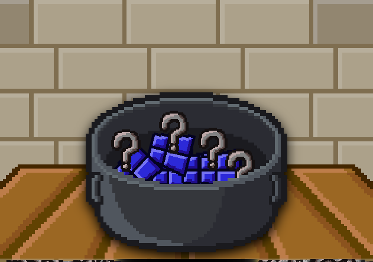
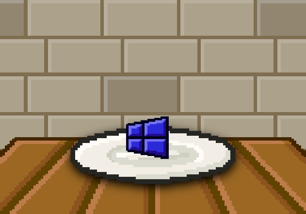

# Break It!

This mod exist for make a ingredient that if you break it appears a unknown ingredient!



## Content

- [x] Ingredients

On the [file](./break_it!.js)

- [x] Tooltips (//)

### Break It!

This ingredient is the general ingredient on the mod.



If you breaks it appears the unknown ingredient (This ingredient it's no from mod.)  < Shape

You can find "Break It!" with typing `windows` or `breakitmod` on the search.

## Code

For view the code click this arrow down (V)

<details>
<summary><b>Code</b></summary>

```javascript
// Nico1Monte's Mod
// Break It!

addIngredient("break_it!",{
    color:"#2926d8",
    shape:"square_quad_leftward",
    keywords:"breakitmod,windows",
    broken:"broken_bark"
});

// Made by Nico1Monte
// Helps by Mods:
// R74nbirthday.js

```

</details>

# IMPORTANT TO VIEW

> [!IMPORTANT]
> Not associated with R74N, not a real product or repository, visit [R74N's GitHub](https://github.com/R74nCom) for real projects. :)
