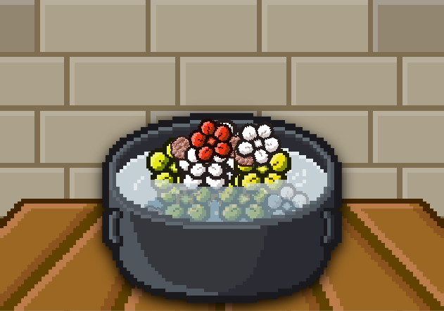
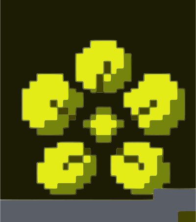
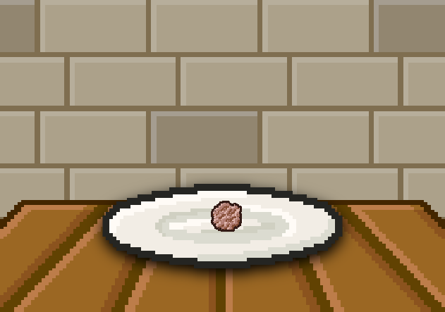
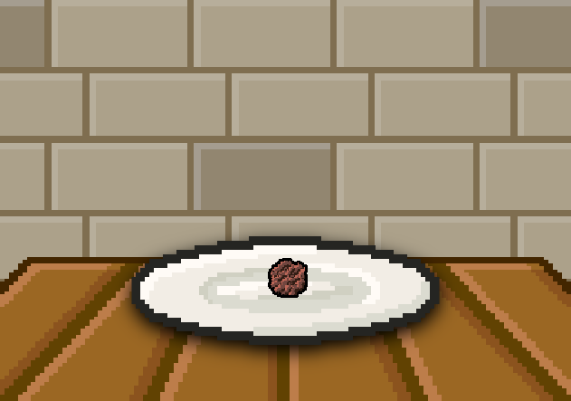
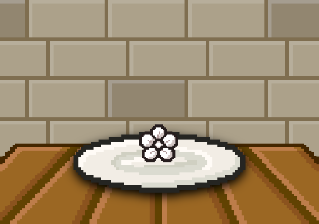
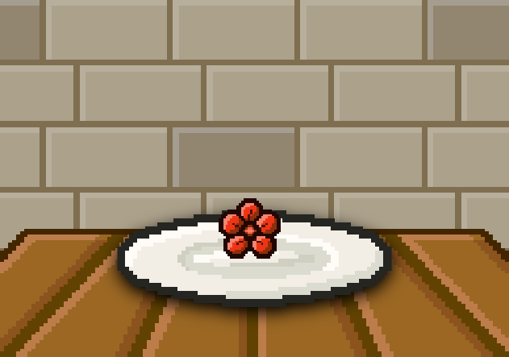
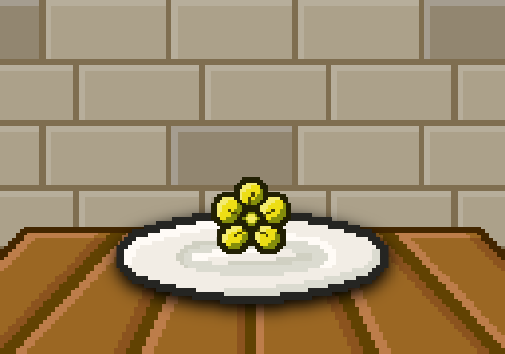

# Cookwers

Flowers to cook




## Content

- [x] Ingredients

On the [file](./cookwers.js)

- [x] Tooltips (//)

### Sunflower

The sunflower can appear with this color:



If you break the sunflower you receive the Flower seeds.

The sunflower how alls flowers have a flower shape!

For find it search `sun`, `flower` or `cookwers`

### Flower Seeds

The flower seeds can appear with this colors:

<p align="left">


</p>

The flower seeds have a interesant shape!

For find it search `flower`, `seeds` or `cookwers`

### Rose

The rose can appear with this colors:

<p align="left">


</p>

If you break the rose you receive the Flower seeds.

The rose how alls flowers have a flower shape!

For find it search `rose` or `cookwers`

### Chrysanthemum

The chrysanthemum can appear with this colors:

<p align="left">


</p>

If you break the chrysanthemum you receive the Flower seeds.

The rose how alls flowers have a flower shape!

For find it search `chrysanthemum`, `flower` or `Cookwers`.

## Code

For view the code click this arrow down (V)

<details>
<summary><b>Code</b></summary>

```javascript
// Nico1Monte's Mod
// Cookwers

// Flowers to use for kooc

addIngredient("sunflower",{
    color:"#e3e513",
    shape:"flower",
    type:"decor",
    keywords:"sun,flower,cookwers",
    broken:"flower_seeds",
    scale:1.3
});

addIngredient("flower_seeds",{
    color:["#71463e", "#b07b71"],
    shape:"foliage",
    type:"decor",
    keywords:"flower,seeds,cookwers",
    scale:0.5
});

addIngredient("rose",{
    color:["#ff2700", "#ffffff"],
    shape:"flower",
    type:"decor",
    scale:1.0,
    keywords:"rose,cookwers",
    broken:"flower_seeds"
});

addIngredient("chrysanthemum",{
    color:["#ffffff", "#ffee00"],
    shape:"flower",
    type:"decor",
    scale:1.3,
    keywords:"chrysanthemum,flower,cookwers",
    broken:"flower_seeds"
});

// Made by Nico1Monte
// Help by Mod:
// a_cook_corners.js
```

</details>

# IMPORTANT TO VIEW

> [!IMPORTANT]
> Not associated with R74N, not a real product or repository, visit [R74N's GitHub](https://github.com/R74nCom) for real projects. :)
