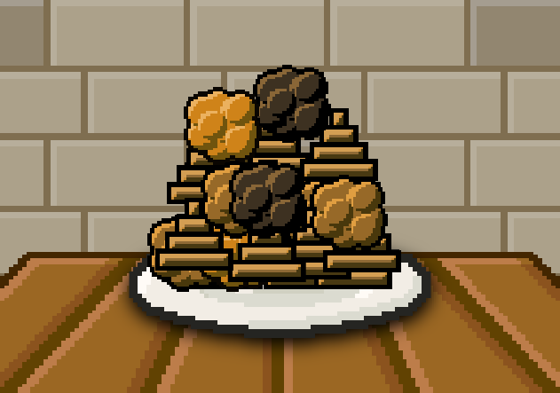

# Poo Mod

This mod add poo for cook!



## Contents

- [x] Ingredients

On the [file](./poo_mod.js)

- [x] Tooltips (//)

### Poo

The general mod ingredient it's poo.


If you make broken the poo appears the fart.

The poo have a poo shape!

You can find the poo typing `poomod` or `poo` on search.

### Fart

Fart appears on breaking the Poo.


How you view on the image fart have 3 colors.

If you break the Fart appears the poo XD.

The fart have a gaseous shape!

You can find the fart typing `poomod`, `gas` or `fart`

## Code

For view the code click this arrow down (V)

<details>
<summary><b>Code</b></summary>

```javascript
// Nico1Monte's Mod
// Poo Mod

addIngredient("poo",{
    color:"#8f6a35",
    shape:"pyramid_tiered",
    keywords:"poomod,poo",
    type:"decor",
    broken:"fart"
});

addIngredient("fart",{
    color:["#d08318", "#956727", "#3c3020"],
    shape:"gas",
    keywords:"poomod,gas,fart",
    type:"decor",
    broken:"poo"
});

// Made by Nico1Monte
```

</details>


# IMPORTANT TO VIEW

> [!IMPORTANT]
> Not associated with R74N, not a real product or repository, visit [R74N's GitHub](https://github.com/R74nCom) for real projects. :)