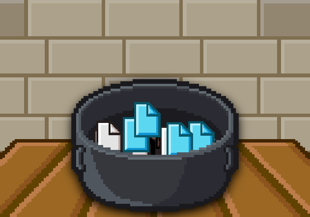
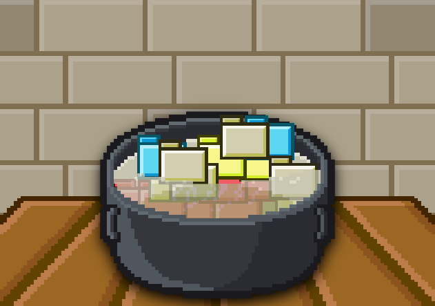

# Troll File

This mod convert all in: 

## Content

- [x] Modify textures.



## What this mod makes

This mod modify all ingredients textures into files. how you see on the preview you can see how it it's, liquids too is files. All shapes it's files.

## How it functions

Using "for" and parameters on JavaScript can modify the textures into files .

## Code

<details>
<summary><b>Code</b></summary>

```javascript
// Nico1Monte's Mod
// Troll File

for (ingredient in ingredients) {
    ingredients[ingredient].shape = "rectangle_fold_top_right"
}

for (ingredient in ingredients) {
    ingredients[ingredient].name = "file"
}

for (ingredient in ingredients) {
    ingredients[ingredient].adj = "file"
}

for (ingredient in ingredients) {
    ingredients[ingredient].behaviour = "0"
}

for (ingredient in ingredients) {
    ingredients[ingredient].placedShape = "rectangle_fold_top_right"
}

for (ingredient in ingredients) {
    ingredients[ingredient].placedShape = "rectangle_fold_top_right"
}

// Made by Nico1Monte
// Help by Mod:
// R74n.js
```

</details>

If you want to cook folders read about this mod:

# Troll Folder



This mod convert all in 

## Content

- [x] Modify textures.

## What this mod makes

This mod modify all ingredients textures into folders. how you see on the preview you can see how it it's, liquids too is folders. All shapes it's folders.

## How it functions

Using "for" and parameters on JavaScript can modify the textures into folders .

## Code

<details>
<summary><b>Code</b></summary>

```javascript
// Nico1Monte's Mod
// Troll Folder

for (ingredient in ingredients) {
    ingredients[ingredient].shape = "rectangle_tab";
    ingredients[ingredient].name = "folder";
    ingredients[ingredient].adj = "folder";
    ingredients[ingredient].behaviour = "0"
    ingredients[ingredient].placedShape = "rectangle_tab"
}

// Made by Nico1Monte
// Help by Mod:
// R74n.js
```

</details>

# IMPORTANT TO VIEW

> [!IMPORTANT]
> Not associated with R74N, not a real product or repository, visit [R74N's GitHub](https://github.com/R74nCom) for real projects. :)